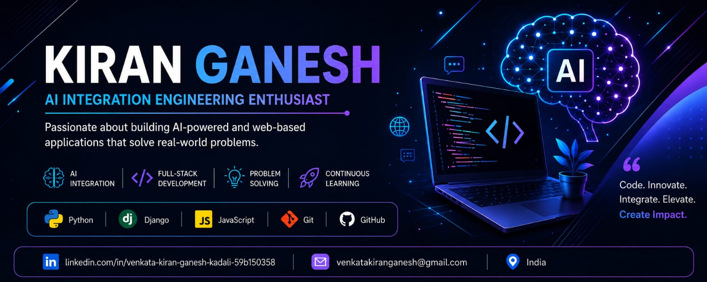

  

  

# 👋 Hi, I'm Kiran Ganesh

## AI Integration Engineering Enthusiast

I am passionate about building AI-powered and web-based applications. I enjoy solving real-world problems through technology and continuously learning new tools and techniques.

## 🛠 Skills

## 🚀 Projects
- Real-Time Communication App
- Simple Ecommerce Store

## 📚 Currently Learning
- AI Integration
- Full-Stack Development
- Machine Learning

## 📫 Connect With Me
- LinkedIn: *(https://www.linkedin.com/in/venkata-kiran-ganesh-kadali-59b150358)
## 📊 GitHub Stats

## 🏆 GitHub Trophies

## 🔥 GitHub Contribution Streak

## 👀 Profile Visitors

## 📈 GitHub Activity Graph

